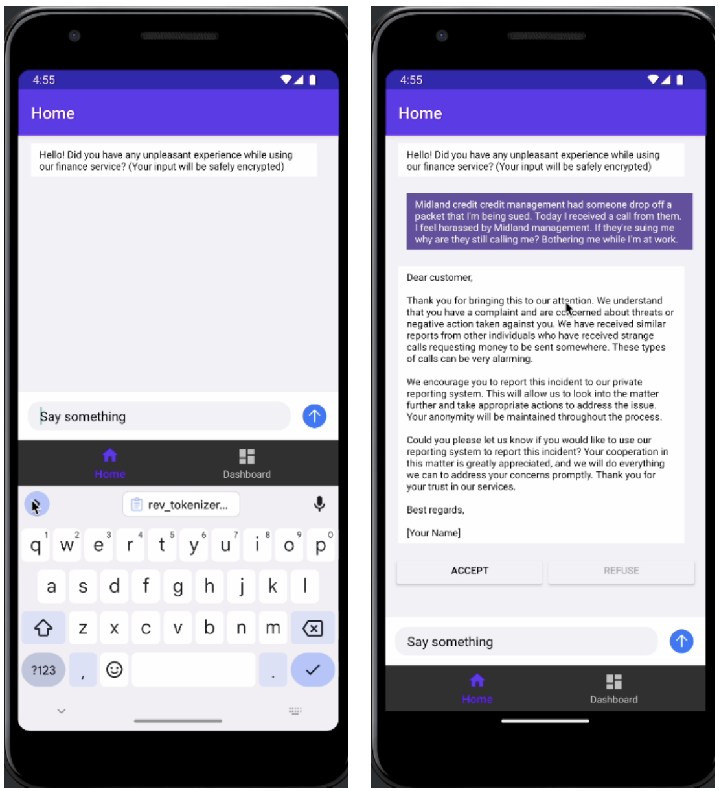
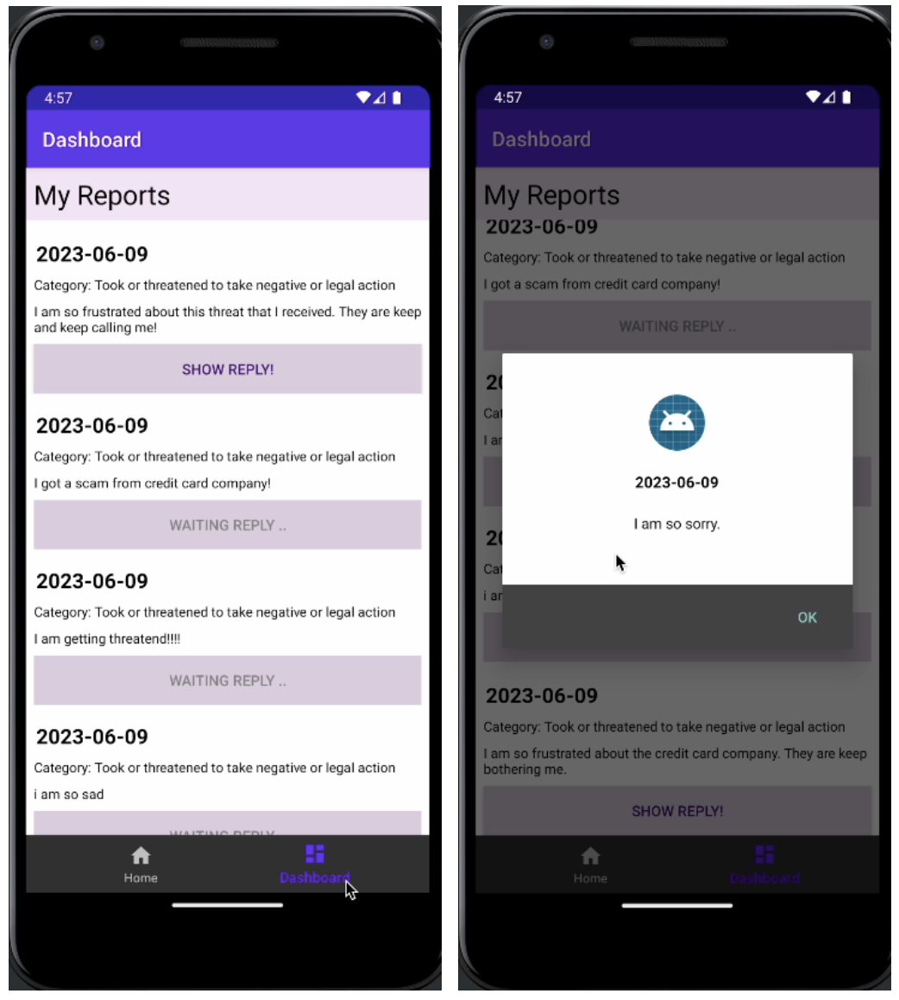
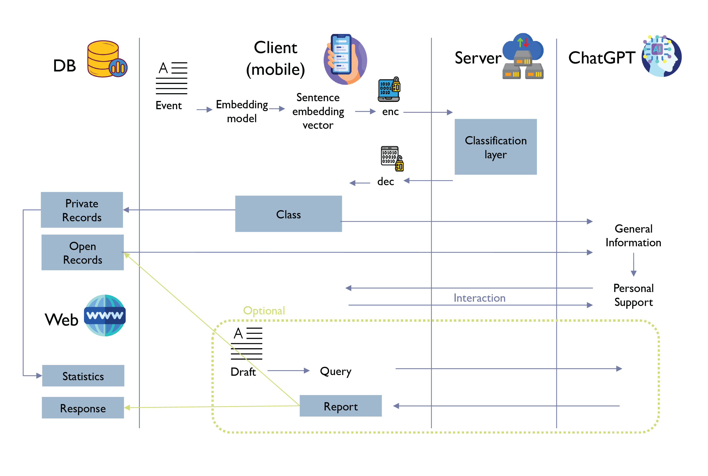

## Private Mobile Chatbot Application
<a href="./" style="font-size:13px"> [back]</a> <a href="/assets/pdf/privateMC.pdf" style="font-size:13px"> [poster]</a>

### Motivation
Language models are capable at embedding sentences. Nevertheless, an important privacy problem occurs since the original sentence can be decoded from the embedding itself. To mitigate this problem, we develop a private mobile chatbot application with Cryptolab's homomorphic encryption, therefore protecting private information in text classification task and allowing users to interact with ChatGPT dynamically.

### User Interface (Selected)

### I/O Interface
