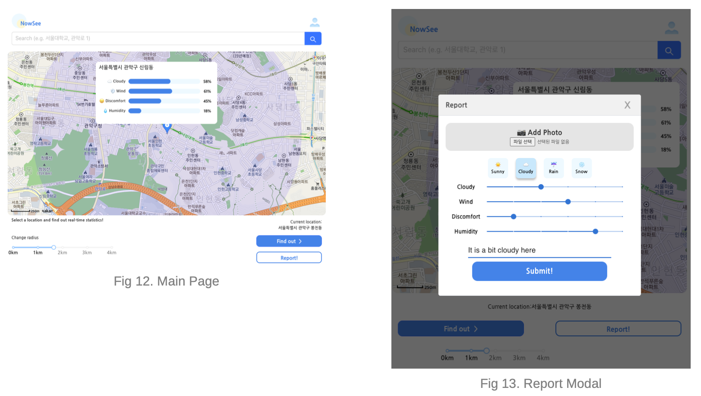
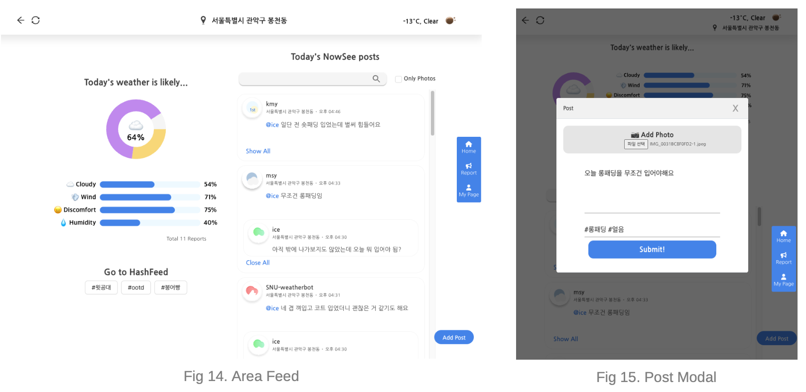
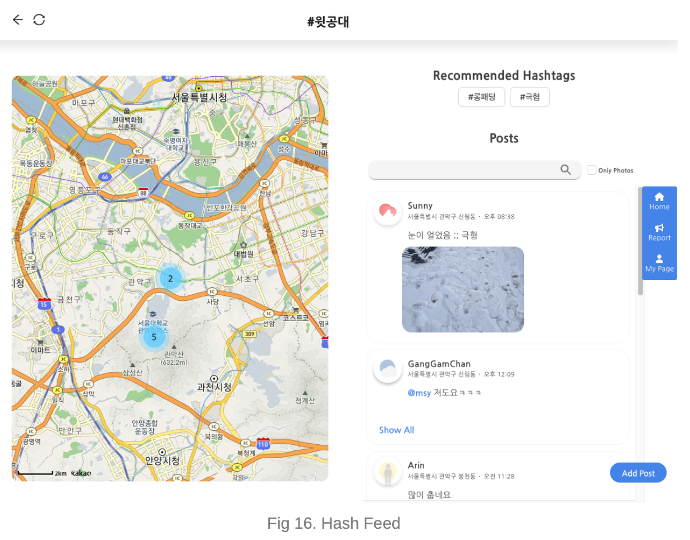
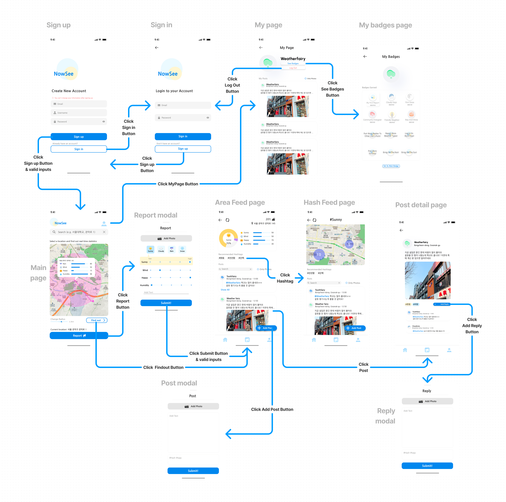
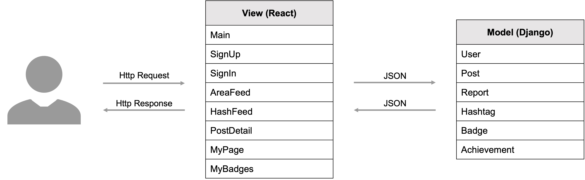

## NowSee, Real-time Weather Community
<a href="./" style="font-size:13px"> [back]</a> <a href="/assets/pdf/nowsee.pdf" style="font-size:13px"> [poster]</a> <a href="https://github.com/swsnu/swppfall2022-team6" style="font-size:13px"> [code]</a>

### Motivation
Nowadays, taking a look at weather forecasts and starting the day is a part of our daily routines. However, weather forecasts are not always perfectly reliable. This summer, the weather app in iPhone consistently showed a question mark with a blurred umbrella: frequent, short rains were unable to predict and varied even between adjacent areas. Also, hazardous weather conditions occasionally call for more than just weather statistics. These weather-related topics frequently come up in people's conversations.

Therefore, we offer NowSee, an everyday, real-time weather community. Our service asks users to complete fast and simple surveys about weather conditions. In return, our service users can:
1. **View real-time weather statistics**  
    Once users select a region, the weather statistics (the weather status and its degree) will be
    displayed. These statistics are updated with real-time data collected from user weather reports. 
2. **Look around live weather feeds**  
    Once users have chosen a location and radius on the map, our service provides a live weather feed of the selected region. Users can easily filter posts by searching for a custom keyword or navigate to the Hashfeed, which displays all posts that include a certain hashtag.
3. **Create weather posts**  
    Users can also contribute to the weather feeds by making new posts; posting comments and pictures of the weather condition. The posts are tagged with their corresponding location and given hashtags. Users can also reply to a particular post, which will be chained to the original post.

### User Interface (Selected)
#### Main Page

#### Area Feed

#### Hash Feed

### Frontend Design

### MVC Architecture

